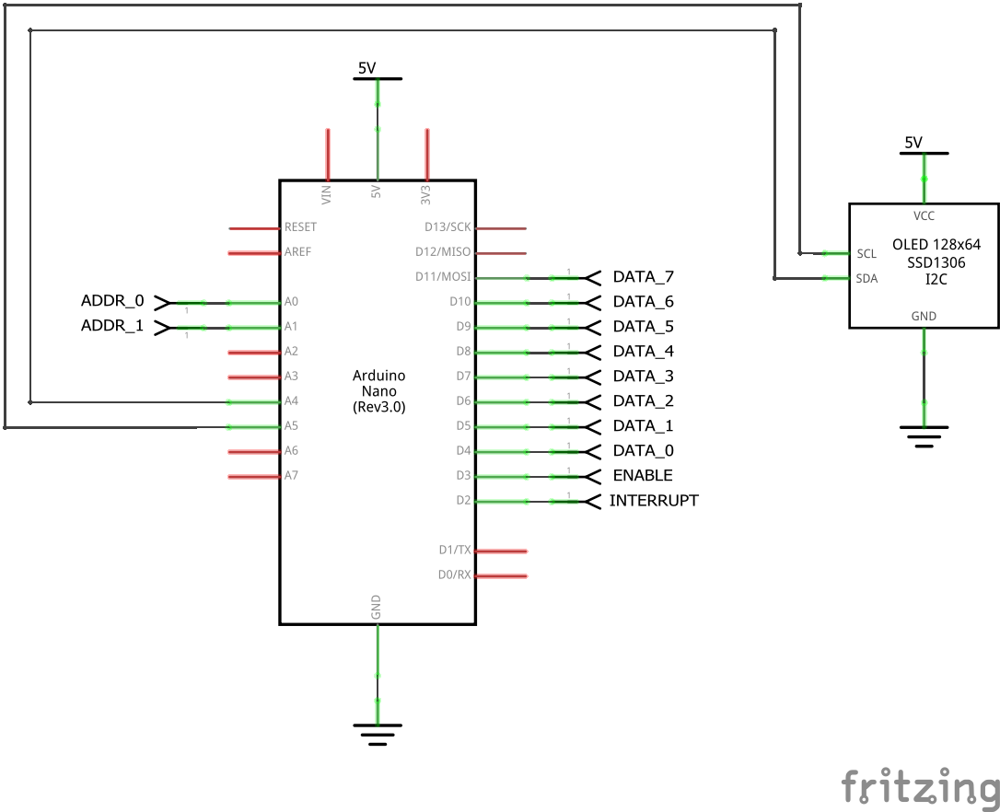

# DIY DISPLAY

A simple memory mapped *OLED display* for the [diy-cpu](https://github.com/skagra/diy-cpu) project.

A `SSD1306` OLED is used to show:

* Two digital values (`value 1` and `value 2`), in binary, hex and decimal.
* A scrolling line of text.

# Interface

The display is interrupt driven.  If the `ENABLE` pin is high, then on a rising edge on the `INTERRUPT` pin the following values are captured :

* `DATA` - 8 bits of data.
* `ADDR` - 2 bits indicating whether the data value should be shown as `value 1`, `value 2` or on the scrolling text line.

`ADDR` encoding is:

| Value | Meaning         |
| ----- | --------------- |
| 0x00  | Digital value 1 |
| 0x01  | Digital value 2 |
| 0x02  | Scrolling text  |
| 0x11  | Unused          |

# Circuit

The pin out is defined in [Pins.h](Pins.h).

# Testing

A separate testing project, which puts the display through its paces, may be found [here](https://github.com/skagra/diy-display-tester).

# Board

The following shows the display board together with the test rig.

